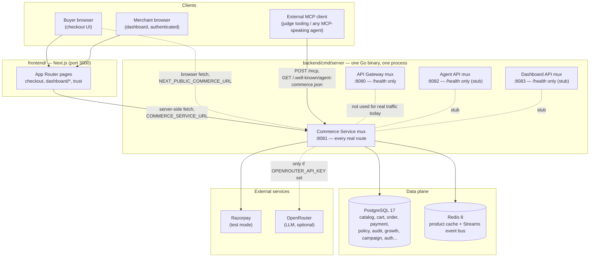
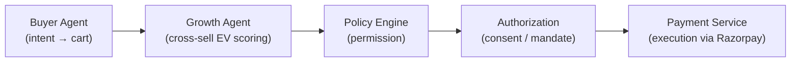
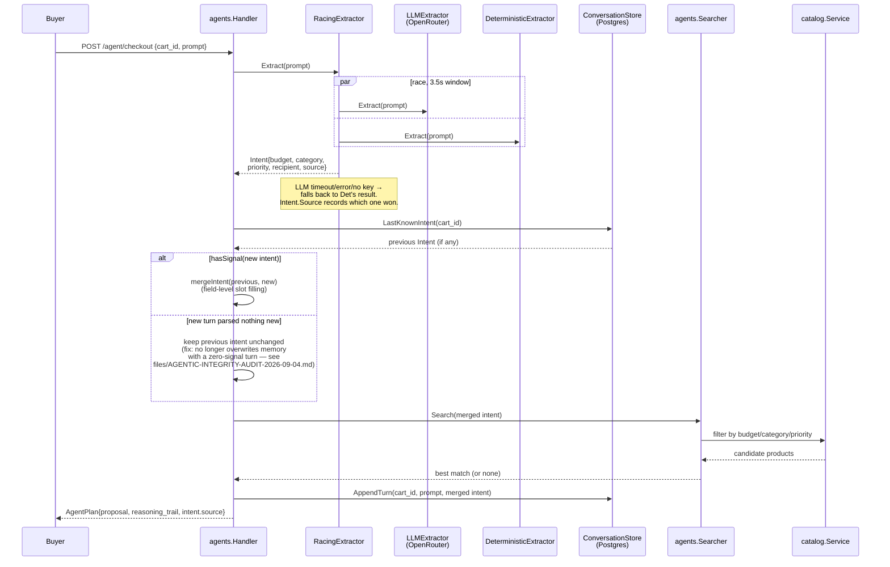
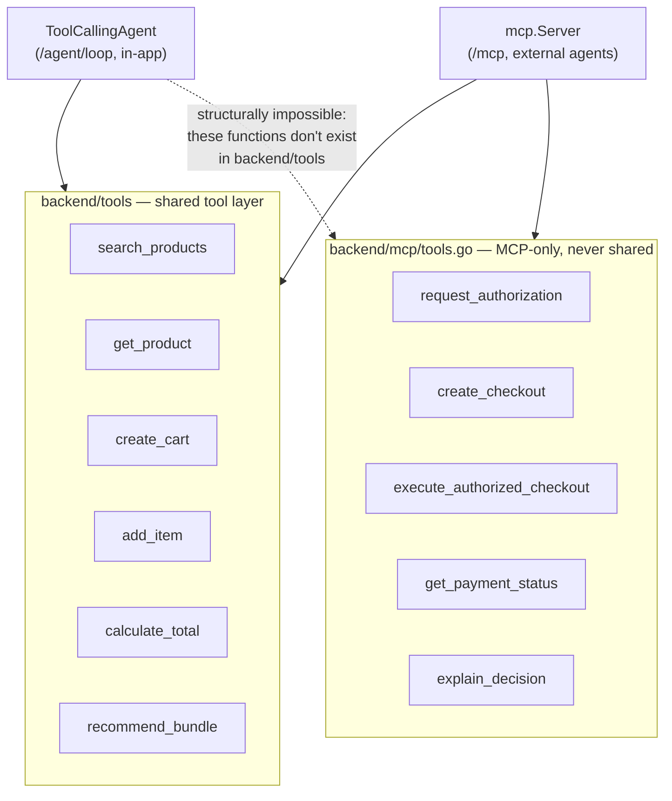
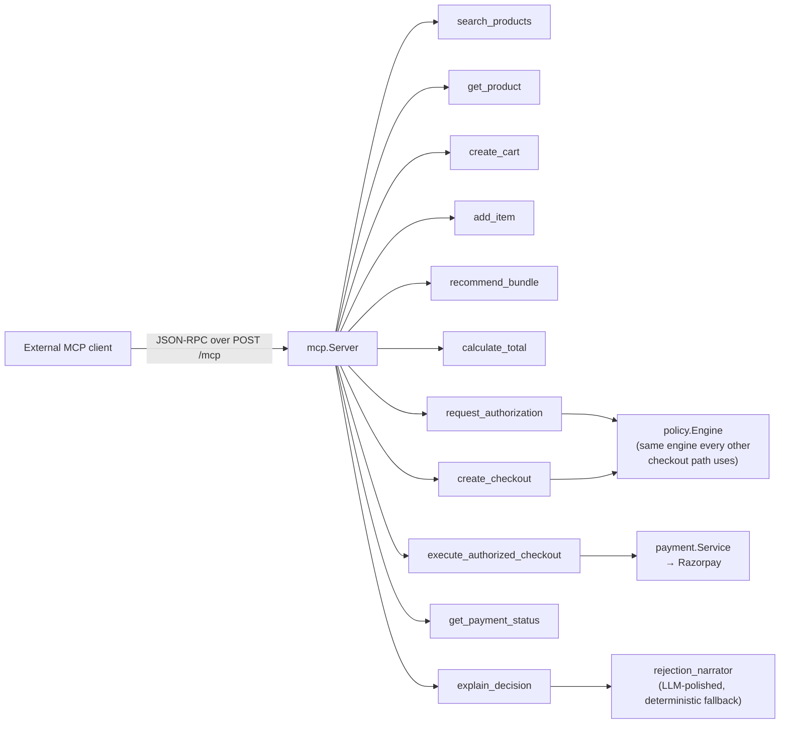
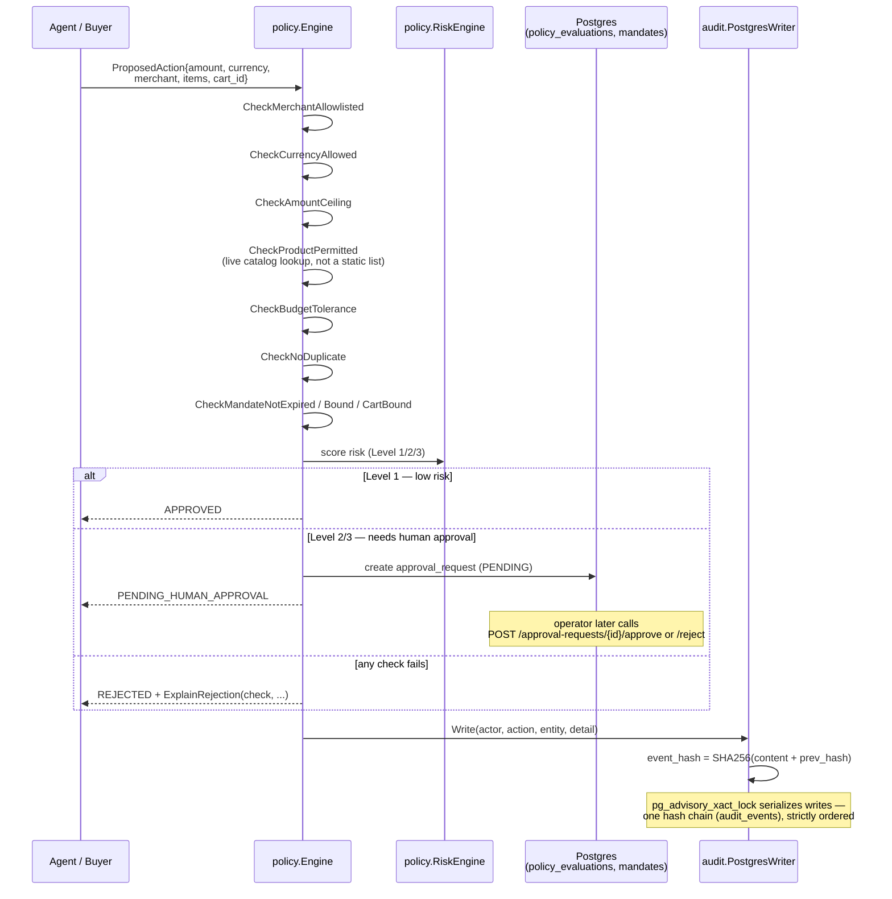
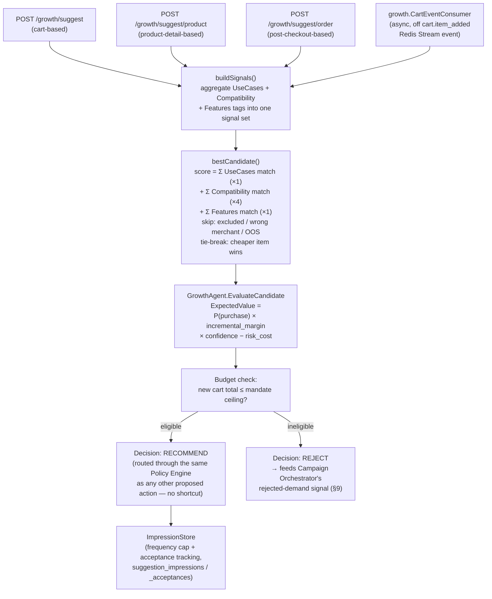
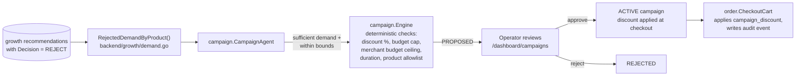
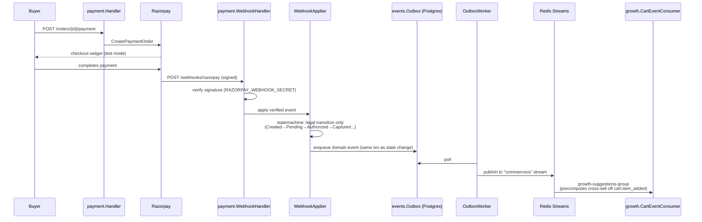
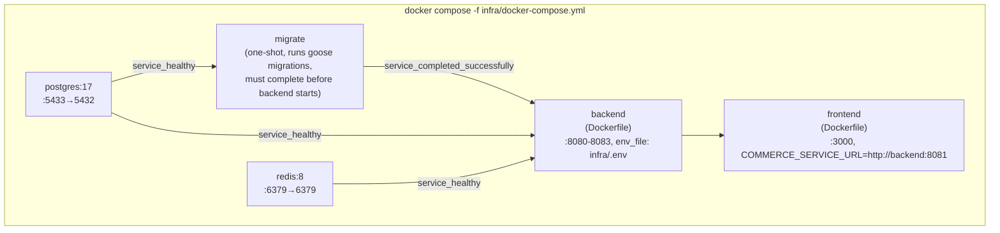

# CommerceOS — Architecture & Data Pipelines

This document maps how CommerceOS is actually wired, as read directly out of
`backend/cmd/server/main.go` (the single dependency-injection root) and each
package's own code, not out of the original planning docs. Where the real
build diverges from an earlier design sketch, that's called out explicitly —
this project's own culture (see `backend/orchestrator/README.md`,
`files/pitch-one-pager.md`) is to document those divergences rather than
paper over them, and this doc follows the same rule.

Every diagram below is Mermaid, so it renders directly on GitHub and in any
Mermaid-aware Markdown viewer.

---

## 1. What this actually is

One Go binary (`backend/cmd/server/main.go`), one Postgres database, one
Redis instance, one Next.js frontend. The binary listens on four ports
(`8080`–`8083`) that were originally meant to be four separate services —
API Gateway, Commerce, Agent API, Dashboard API — but today three of those
four muxes are near-empty stubs and **every real route lives on the
Commerce Service, port 8081**. This is a documented, deliberate choice, not
an oversight:

> "collapsing four network hops into one process for a prototype this size
> is a feature, not a gap — splitting them now would be exactly the 'seven
> microservices for architecture theatre' anti-pattern this project
> explicitly rejects." — `backend/cmd/server/main.go`, Service Routers section

So: **CommerceOS is a modular monolith**, structured internally like
several services (clean package boundaries, one Go package per bounded
context) but deployed as one process. The diagram below reflects that
honestly — the "four services" are four `http.ServeMux` values inside one
`main()`, not four deployables.

---

## 2. Request routing surface (Commerce Service, `:8081`)

Every route below is registered on `commerceMux` in `main.go`. "Auth"
follows `files/AUTH.md`'s rule: buyer/checkout stays guest-accessible by
design (an agent or a buyer with no account must be able to shop); merchant
operations require an operator session (`authService.RequireOperator`); a
few routes are deliberately public for judge/agent inspection.

| Area | Routes | Auth |
|---|---|---|
| Catalog | `GET/POST /products`, `GET/PATCH/DELETE /products/{id}`, `GET /products/{id}/reviews[/summary]`, `GET/POST /products/{id}/variants`, `GET/PATCH/DELETE /variants/{id}` | GET open; writes operator-only |
| Cart | `POST /carts`, `GET /carts/{id}`, `POST /carts/{id}/items`, `PATCH/DELETE /carts/{id}/items/{id}`, `POST /carts/{id}/checkout` | Open (guest checkout) |
| Orders | `GET /orders`, `GET /orders/{id}`, `POST /orders/{id}/review` | Open (buyer's own order history has no login) |
| Payment | `POST /orders/{id}/payment`, `POST /orders/{id}/payment/verify`, `GET /orders/{id}/payment`, `/orders/{id}/recovery*`, `GET /adapter/calls`, `POST /webhooks/razorpay` | Open (guest checkout) / webhook signed by Razorpay |
| Buyer agent | `POST /agent/checkout` (single-shot), `POST /agent/loop` (bounded tool-calling) | Open, both rate-limited (§5) |
| Growth / cross-sell | `POST /growth/evaluate`, `GET /growth/recommend/{id}`, `POST /growth/suggest`, `/growth/suggest/product`, `/growth/suggest/order`, `/growth/suggest/dismiss`, `/growth/suggest/accept` | Open |
| Policy & mandates | `POST /policy/mandates`, `POST /policy/propose`, `GET /approval-requests`, `/approval-requests/{id}[/approve\|reject]`, `POST /audit/verify` | Mixed — see §6 |
| Campaigns | `/campaigns*` (propose, list, export, get, approve, reject) | Operator-only |
| Safety / red-team | `/safety/attacks*`, `/safety/evaluations*` | Operator-only |
| Trust (public) | `GET /trust/summary`, `POST /trust/run-suite` | **Public, no login** — judge-facing mirror of `/audit/verify` + `/safety/evaluations/run` |
| Runs (replay) | `GET /runs` (list), `GET /runs/{id}` (detail) | List operator-only; detail public (buyer's own audit trail) |
| Auth | `/auth/login`, `/auth/logout`, `/auth/invites*`, `/auth/operators*` | Mixed |
| Dashboard | `/dashboard/overview`, `/dashboard/metrics`, `/dashboard/experiment[s]`, `/dashboard/settings/policy`, `/dashboard/growth`, `/dashboard/orders[/export]` | Operator-only |
| MCP | `POST /mcp`, `GET /.well-known/agent-commerce.json` | Public (agent-facing by design) |
| x402 demo | `POST /x402/priority-support` | Public, standalone test-mode stub — does not touch orders/policy/audit |

---

## 3. The core coordination path

This is the one sequence every checkout ultimately goes through, stated
verbatim (structure preserved) from `backend/orchestrator/README.md` — the
directory that documents *why there is no separate orchestrator package*:
every stage below is a direct Go interface call between packages that
already exist, traceable in `main.go`'s wiring, not hidden behind a generic
coordination abstraction.

---

## 4. Shopping agent — single-shot pipeline (`POST /agent/checkout`)

`BuyerAgent.PlanCheckoutInConversation` (`backend/agents/buyer_agent.go`) is
a fixed pipeline: extract intent → merge with cart memory → search catalog
→ propose one product. It is **not** a multi-turn tool-calling loop — see
§5 for the one that is.

Key correctness property (fixed 2026-09-04, see
`files/AGENTIC-INTEGRITY-AUDIT-2026-09-04.md`): a follow-up prompt that
extracts **no new signal at all** (e.g. an off-topic or garbled message)
no longer silently clobbers the cart's remembered intent with an empty
one — `hasSignal()` gates the merge, and `conversation_test.go` regression-
tests the exact incident this fixed.

---

## 5. Shopping agent — bounded tool-calling loop (`POST /agent/loop`)

A second, genuinely multi-step agentic path (`agents.ToolCallingAgent`,
`backend/agents/tool_loop.go`). The model decides turn-by-turn which tool
to call, capped at **4 tool-call round trips** and a **12s wall-clock
budget**. Its tool palette is a hard *structural* subset — the money-moving
tools aren't reachable because they aren't Go functions this type can call
at all, not because of a runtime check:

`backend/tools`'s own package doc comment states the intent directly:
"the in-app bounded tool-calling loop must never be able to reach the
money-moving/authorization tools itself; keeping them out of this shared
package is what makes that structurally true rather than merely policy."

Both `/agent/checkout` and `/agent/loop` sit behind the same
`ratelimit.Limiter` (`llmLimiter`): burst 10, refilling at 1 request/6s per
caller IP — the fix for "currently no rate limiting exists anywhere in the
codebase" noted in an earlier audit.

---

## 6. MCP tool surface (`POST /mcp`, `.well-known/agent-commerce.json`)

The full 11-tool surface any MCP-speaking external agent can call — the
first 6 are the shared layer from §5; the last 5 are MCP-exclusive:

`GET /.well-known/agent-commerce.json` serves a live manifest
(`mcp.ManifestHandler`) that reads `policyEngine.Config()` at request time
— not a cached startup snapshot — so an operator-edited ceiling
(`/dashboard/settings/policy`) is reflected immediately.

---

## 7. Checkout authorization & audit pipeline

The "hard chokepoint" every proposed action must pass, and the
tamper-evident ledger every consequential action writes to.

Verification (`GET /audit/verify`, and the public `GET /trust/summary`)
walks every row and recomputes `event_hash` from `(content, prev_hash)` —
any mismatch anywhere in the chain is reported as `ChainBroken: true` with
the offending row ID.

---

## 8. Growth / cross-sell pipeline

Three HTTP entry points (cart-based, product-detail-based, post-checkout-
based) all funnel through **one** scoring function,
`bestCandidate` — the package's own doc comment is explicit that this is
deliberate: "One scoring function, ... call sites — no duplicated logic."

The `compatibilityMatchWeight = 4` weighting (fixed 2026-09-04) exists
because every warranty/protection SKU in the catalog (AppleCare family)
shares near-identical `features`/`use_cases` tags regardless of which
device it covers — only `Compatibility` encodes real device fit, so it has
to dominate the generic, broadly-shared tags rather than being drowned out
by them. See `backend/growth/suggest.go`'s doc comment on that constant for
the full incident this fixed.

---

## 9. Campaign orchestrator (merchant-side promotions)

Closes the loop on rejected cross-sell demand: instead of a rejected
recommendation just disappearing, it becomes evidence for a proposed
discount campaign.

Same "deterministic gate, never the LLM" posture as the checkout Policy
Engine — `campaign`'s own package doc comment says this explicitly.

---

## 10. Payment, webhooks, and the event bus

The outbox pattern (write the event in the same DB transaction as the
state change, publish asynchronously) is what makes the Redis Streams
publish step crash-safe — a worker crash between commit and publish just
means a delayed publish on restart, never a lost or duplicated state
change.

---

## 11. Data stores

**Postgres 17** — one database, ~35 migrations (`db/migrations/`), grouped
by bounded context:

| Domain | Key tables |
|---|---|
| Catalog | products, variants |
| Cart / Order | carts, cart_items, orders, order_items |
| Payment | payments, payment_attempts, webhook_events |
| Policy / audit | mandates, authorizations, policy_evaluations, approval_requests, policy_settings, **audit_events** (hash chain) |
| Growth | recommendations, suggestion_dismissals, suggestion_impressions/acceptances |
| Campaign | campaigns (+ approval fields) |
| Agent memory | agent_conversations, agent_plans |
| Reviews | reviews |
| Auth | operators, operator_invites |
| Events | outbox_events |
| Safety | safety attack/evaluation tables |

**Redis 8** — two independent uses of the same instance: (1) an 8-second
TTL cache in front of `GET /products` (`catalog.NewRedisProductsCache`,
invalidated on every catalog mutation), and (2) the Streams-based event
bus (`events.NewRedisStreamBus`) carrying `cart.item_added` and other
domain events to the outbox worker's consumers.

---

## 12. Deployment topology (`infra/docker-compose.yml`)

Two notable fixes baked into this file (both dated 2026-09-04, see
`files/AGENTIC-INTEGRITY-AUDIT-2026-09-04.md`):

- `env_file: .env` on the `backend` service — previously,
  `RAZORPAY_KEY_ID/SECRET` and `OPENROUTER_API_KEY`/`LLM_BASE_URL`/
  `LLM_MODEL` reached the container as empty strings whenever
  `docker compose` was invoked from the repo root (the documented way),
  because Compose's `${VAR}` interpolation resolves against the *invoking
  shell's* cwd, not the compose file's own directory. The backend silently
  fell back to no Razorpay config and the deterministic-only intent
  extractor, with no error or log line marking that it had happened.
- Explicit `depends_on: condition: service_healthy` (Postgres/Redis) and
  `condition: service_completed_successfully` (migrate) — removes a
  first-run crash-loop on a genuinely fresh `docker compose up`.

---

## 13. Trust & safety surfaces

- **`backend/safety`** — a 14-attack red-team library (`AttackLibrary`,
  `att_1`…`att_14`, including a deliberately planted prompt-injection
  payload in `db/seeds/001_catalog.sql`'s `wireless-charging-pad`
  product) run against the *real* policy pipeline and the *real*
  Razorpay call counter, not a mock.
- **`backend/trust`** — a public, unauthenticated mirror of `/audit/verify`
  and `/safety/evaluations/run` (`GET /trust/summary`,
  `POST /trust/run-suite`), deliberately reachable without an operator
  login so a judge's own tooling can independently verify the audit chain
  and re-run the attack suite. Its own doc comment argues this exposes "no
  new evidence, no new capability" beyond what's already gated elsewhere.
- **`backend/statemachine`** — one explicit transition table per stateful
  entity (payment, order, review), used by `commerce/order`,
  `commerce/payment`, and `commerce/review`'s repositories so that "what
  transitions are legal" has exactly one source of truth instead of
  scattered `if` checks.

---

## 14. Known architectural gaps (stated plainly, not hidden)

In the same spirit as `backend/orchestrator/README.md` documenting its own
absence, these are real, current limitations worth knowing before treating
any diagram above as more finished than it is:

- **Four "services," one process.** The API Gateway (`:8080`), Agent API
  (`:8082`), and Dashboard API (`:8083`) muxes exist and each pass their
  own health check, but carry no real traffic — every actual route is on
  the Commerce Service (`:8081`). Splitting them apart would be one config
  change, but hasn't been done, and the project's own position (§1) is
  that it shouldn't be, at this size.
- **`backend/orchestrator` is an empty marker directory** — there is no
  standalone orchestration layer; the Buyer→Growth→Policy→Payment sequence
  in §3 is direct interface calls between handlers, by design.
- **The single-shot agent (`/agent/checkout`) is not a tool-calling loop.**
  It's a fixed extract→search→propose pipeline (§4). The genuinely
  multi-step agent is the separate, newer `/agent/loop` path (§5).
- **LLM-backed features degrade to deterministic behavior silently when
  `OPENROUTER_API_KEY` is unset** — by design (nil-receiver-safe `WithX`
  pattern throughout `main.go`), but this means "no visible AI reasoning"
  and "the key isn't loading" look identical from the UI alone unless you
  check `Intent.Source` (§4) or the `/trust/summary`/env-var verification
  steps in `README.md`.

---

*Generated from a direct read of the codebase (`backend/cmd/server/main.go`,
package doc comments, and migration/seed files) on 2026-09-04. If the
wiring changes, this file will drift — treat `main.go` itself as the
ground truth and this as a snapshot of it.*
