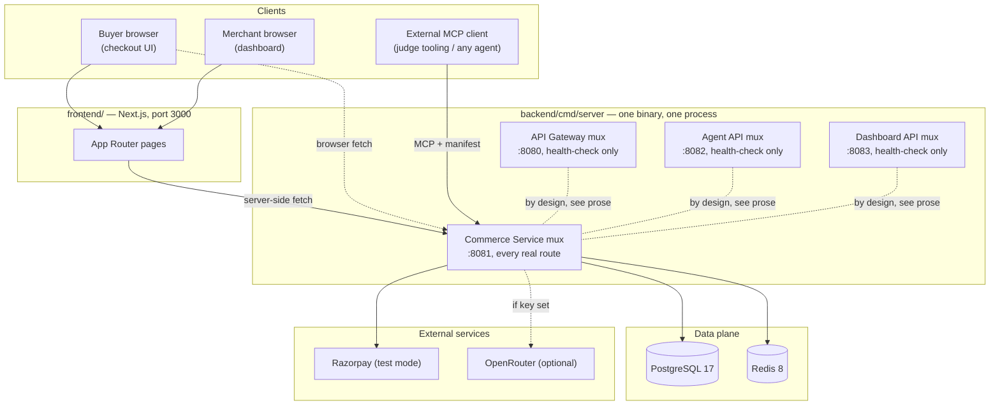
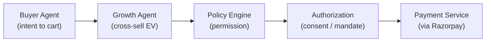
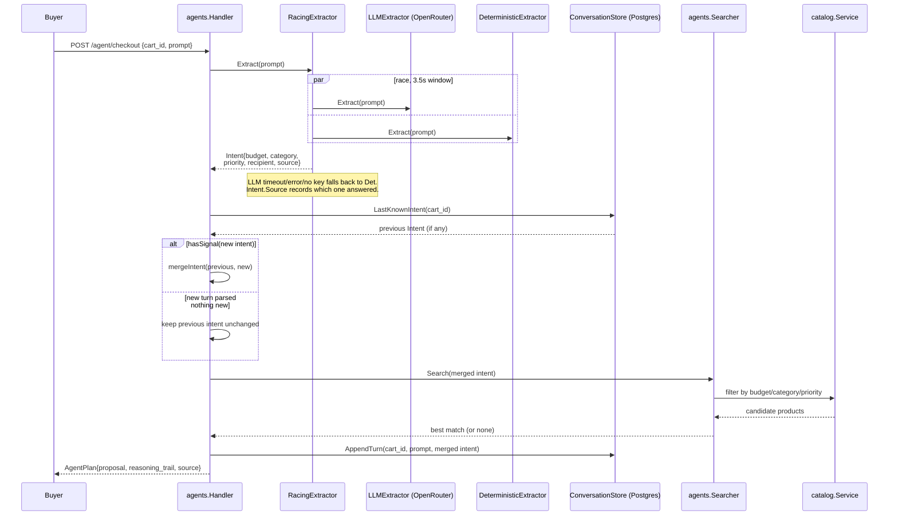
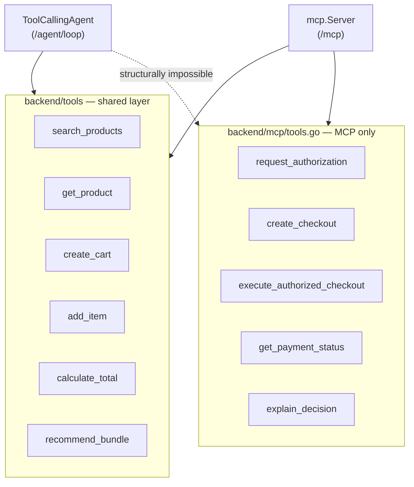
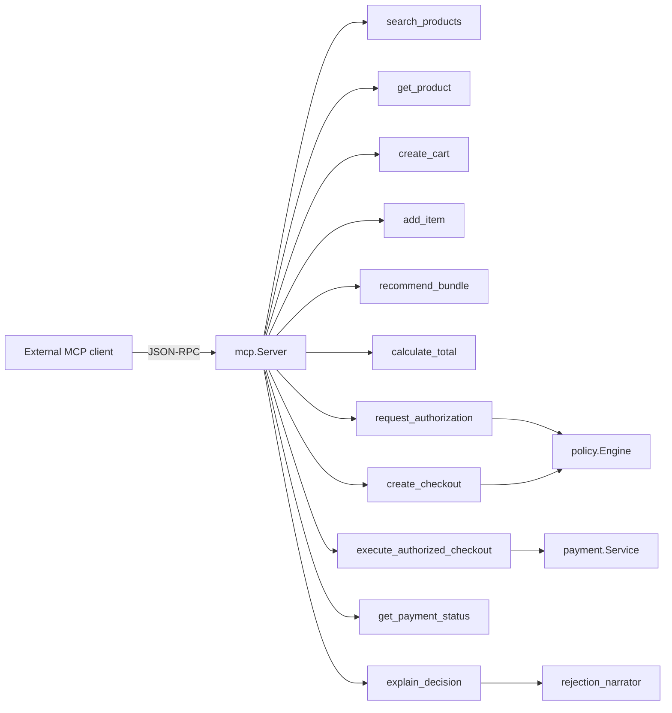
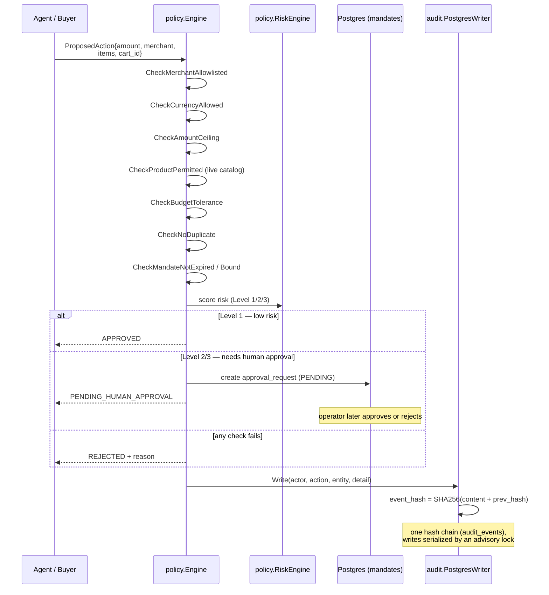
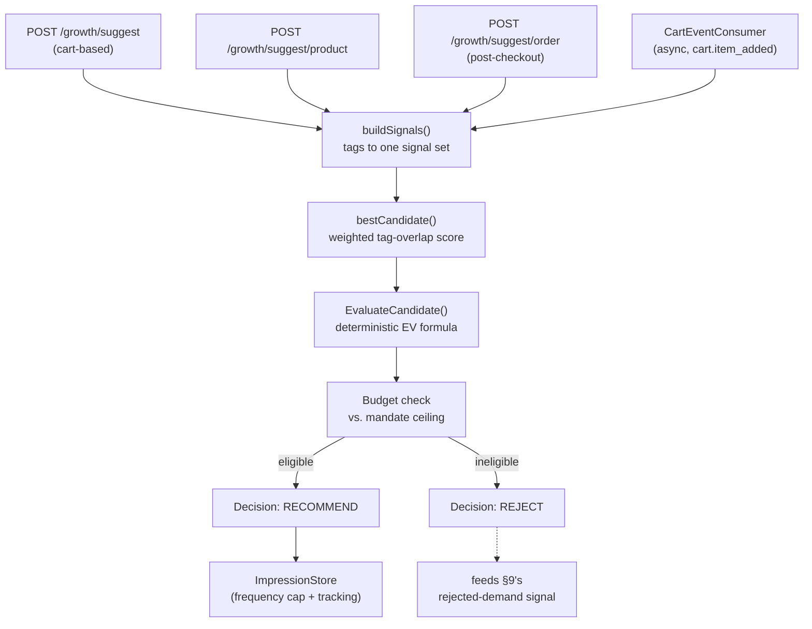
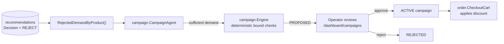
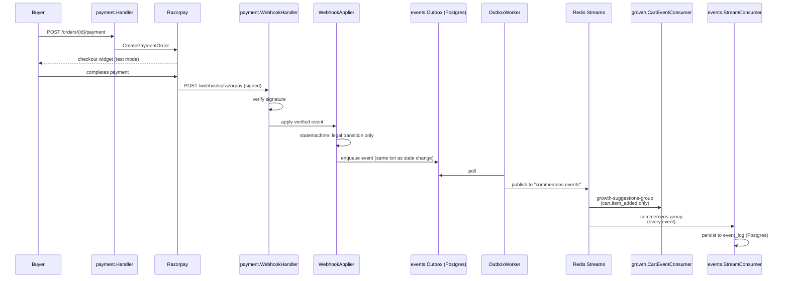
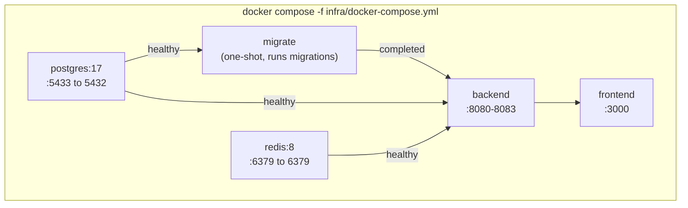

# CommerceOS — Architecture & Data Pipelines

This document maps how CommerceOS is actually wired, as read directly out of
`backend/cmd/server/main.go` (the single dependency-injection root) and each
package's own code, not out of the original planning docs. Where the real
build diverges from an earlier design sketch, that's called out explicitly —
this project's own culture (see `backend/orchestrator/README.md`,
`files/pitch-one-pager.md`) is to document those divergences rather than
paper over them, and this doc follows the same rule.

Every diagram below is Mermaid, so it renders directly on GitHub and in any
Mermaid-aware Markdown viewer. Diagram nodes are deliberately kept short
(a title plus at most one short clarifier line) — the full explanation
always lives in the prose around the diagram, never crammed into a box.

---

## 1. What this actually is

One Go binary (`backend/cmd/server/main.go`), one Postgres database, one
Redis instance, one Next.js frontend. The binary listens on four ports
(`8080`–`8083`) that were originally meant to be four separate services —
API Gateway, Commerce, Agent API, Dashboard API — but today three of those
four muxes only ever answer their own health check, and **every real route
lives on the Commerce Service, port 8081**. This is a documented,
deliberate choice, not an oversight:

> "collapsing four network hops into one process for a prototype this size
> is a feature, not a gap — splitting them now would be exactly the 'seven
> microservices for architecture theatre' anti-pattern this project
> explicitly rejects." — `backend/cmd/server/main.go`, Service Routers section

So: **CommerceOS is a modular monolith**, structured internally like
several services (clean package boundaries, one Go package per bounded
context) but deployed as one process. The diagram below reflects that
honestly — the "four services" are four `http.ServeMux` values inside one
`main()`, not four deployables. The three health-check-only muxes are
labeled that way rather than called "stubs": nothing about them is
unfinished, they're a deliberate seam kept ready in case the monolith is
ever split later.

The frontend reaches the backend two different ways depending on where the
code runs: server-side page rendering calls `COMMERCE_SERVICE_URL`
(`http://backend:8081` inside the Compose network), while the browser's own
client-side fetches use `NEXT_PUBLIC_COMMERCE_URL` (the host's published
`localhost:8081`) — see §12.

---

## 2. Request routing surface (Commerce Service, `:8081`)

Every route below is registered on `commerceMux` in `main.go`. "Auth"
follows `files/AUTH.md`'s rule: buyer/checkout stays guest-accessible by
design (an agent or a buyer with no account must be able to shop); merchant
operations require an operator session (`authService.RequireOperator`); a
few routes are deliberately public for judge/agent inspection.

| Area | Routes | Auth |
|---|---|---|
| Catalog | `GET/POST /products`, `GET/PATCH/DELETE /products/{id}`, `GET /products/{id}/reviews[/summary]`, `GET/POST /products/{id}/variants`, `GET/PATCH/DELETE /variants/{id}` | GET open; writes operator-only |
| Cart | `POST /carts`, `GET /carts/{id}`, `POST /carts/{id}/items`, `PATCH/DELETE /carts/{id}/items/{id}`, `POST /carts/{id}/checkout` | Open (guest checkout) |
| Orders | `GET /orders`, `GET /orders/{id}`, `POST /orders/{id}/review` | Open (buyer's own order history has no login) |
| Payment | `POST /orders/{id}/payment`, `POST /orders/{id}/payment/verify`, `GET /orders/{id}/payment`, `/orders/{id}/recovery*`, `GET /adapter/calls`, `POST /webhooks/razorpay` | Open (guest checkout) / webhook signed by Razorpay |
| Buyer agent | `POST /agent/checkout` (single-shot), `POST /agent/loop` (bounded tool-calling) | Open, both rate-limited (§5) |
| Growth / cross-sell | `POST /growth/evaluate`, `GET /growth/recommend/{id}`, `POST /growth/suggest`, `/growth/suggest/product`, `/growth/suggest/order`, `/growth/suggest/dismiss`, `/growth/suggest/accept` | Open |
| Policy & mandates | `POST /policy/mandates`, `POST /policy/propose`, `GET /approval-requests`, `/approval-requests/{id}[/approve\|reject]`, `POST /audit/verify` | Mixed — see §7 |
| Campaigns | `/campaigns*` (propose, list, export, get, approve, reject) | Operator-only |
| Safety / red-team | `/safety/attacks*`, `/safety/evaluations*` | Operator-only |
| Trust (public) | `GET /trust/summary`, `POST /trust/run-suite` | **Public, no login** — judge-facing mirror of `/audit/verify` + `/safety/evaluations/run` |
| Runs (replay) | `GET /runs` (list), `GET /runs/{id}` (detail) | List operator-only; detail public (buyer's own audit trail) |
| Auth | `/auth/login`, `/auth/logout`, `/auth/invites*`, `/auth/operators*` | Mixed |
| Dashboard | `/dashboard/overview`, `/dashboard/metrics`, `/dashboard/experiment[s]`, `/dashboard/settings/policy`, `/dashboard/growth`, `/dashboard/orders[/export]` | Operator-only |
| MCP | `POST /mcp`, `GET /.well-known/agent-commerce.json` | Public (agent-facing by design) |
| x402 demo | `POST /x402/priority-support` | Public, standalone test-mode demo — deliberately does not touch orders/policy/audit (see §14) |

---

## 3. The core coordination path

This is the one sequence every checkout ultimately goes through, stated
verbatim (structure preserved) from `backend/orchestrator/README.md` — the
directory that documents *why there is no separate orchestrator package*:
every stage below is a direct Go interface call between packages that
already exist, traceable in `main.go`'s wiring, not hidden behind a generic
coordination abstraction.

---

## 4. Shopping agent — single-shot pipeline (`POST /agent/checkout`)

`BuyerAgent.PlanCheckoutInConversation` (`backend/agents/buyer_agent.go`) is
a fixed pipeline: extract intent, merge with cart memory, search the
catalog, propose one product. It is **not** a multi-turn tool-calling loop
— see §5 for the one that is.

Key correctness property (fixed 2026-09-04, see
`files/AGENTIC-INTEGRITY-AUDIT-2026-09-04.md`): a follow-up prompt that
extracts **no new signal at all** (e.g. an off-topic or garbled message)
no longer silently clobbers the cart's remembered intent with an empty
one — `hasSignal()` gates the merge in the `alt` block above, and
`conversation_test.go` regression-tests the exact incident this fixed.

---

## 5. Shopping agent — bounded tool-calling loop (`POST /agent/loop`)

A second, genuinely multi-step agentic path (`agents.ToolCallingAgent`,
`backend/agents/tool_loop.go`). The model decides turn-by-turn which tool
to call, capped at **4 tool-call round trips** and a **12s wall-clock
budget**. Its tool palette is a hard *structural* subset — the money-moving
tools aren't reachable because they aren't Go functions this type can call
at all, not because of a runtime check:

`backend/tools`'s own package doc comment states the intent directly:
"the in-app bounded tool-calling loop must never be able to reach the
money-moving/authorization tools itself; keeping them out of this shared
package is what makes that structurally true rather than merely policy."

Both `/agent/checkout` and `/agent/loop` sit behind the same
`ratelimit.Limiter` (`llmLimiter`): burst 10, refilling at 1 request/6s per
caller IP — the fix for "currently no rate limiting exists anywhere in the
codebase" noted in an earlier audit.

---

## 6. MCP tool surface (`POST /mcp`, `.well-known/agent-commerce.json`)

The full 11-tool surface any MCP-speaking external agent can call — the
first 6 are the shared layer from §5; the last 5 are MCP-exclusive:

`PolicyEngine` here is the exact same engine every other checkout path
(§7) uses — no separate MCP-only copy. `RejectionNarrator` LLM-polishes a
deterministic rejection sentence and falls back to the unmodified sentence
on any LLM failure.

`GET /.well-known/agent-commerce.json` serves a live manifest
(`mcp.ManifestHandler`) that reads `policyEngine.Config()` at request time
— not a cached startup snapshot — so an operator-edited ceiling
(`/dashboard/settings/policy`) is reflected immediately.

---

## 7. Checkout authorization & audit pipeline

The "hard chokepoint" every proposed action must pass, and the
tamper-evident ledger every consequential action writes to.

Verification (`GET /audit/verify`, and the public `GET /trust/summary`)
walks every row and recomputes `event_hash` from `(content, prev_hash)` —
any mismatch anywhere in the chain is reported as `ChainBroken: true` with
the offending row ID.

---

## 8. Growth / cross-sell pipeline

Three HTTP entry points (cart-based, product-detail-based, post-checkout-
based) plus one async event consumer all funnel through **one** scoring
function, `bestCandidate` — the package's own doc comment is explicit that
this is deliberate: "One scoring function, ... call sites — no duplicated
logic."

Two formulas power this, both pure functions with no LLM call:

- **`bestCandidate` score** = 1 point per matching `UseCases` tag, **4**
  points per matching `Compatibility` tag (`compatibilityMatchWeight`), 1
  point per matching `Features` tag; ties break toward the cheaper item.
  The 4x weight (fixed 2026-09-04) exists because every warranty SKU in
  the catalog (the AppleCare family) shares near-identical
  `features`/`use_cases` tags regardless of which device it covers — only
  `Compatibility` encodes real device fit, so it has to dominate the
  generic, broadly-shared tags instead of being drowned out by them. See
  `backend/growth/suggest.go`'s doc comment on `compatibilityMatchWeight`
  for the live incident this fixed.
- **`ExpectedValue`** (`backend/growth/ev.go`) = `P(purchase) ×
  incremental_margin × confidence − risk_cost`.

---

## 9. Campaign orchestrator (merchant-side promotions)

Closes the loop on rejected cross-sell demand: instead of a rejected
recommendation just disappearing, it becomes evidence for a proposed
discount campaign.

`campaign.Engine`'s bound checks are: discount-percent bounded, budget-cap
bounded, merchant budget ceiling, duration bounded, and product
allowlisted — the same "deterministic gate, never the LLM" posture as the
checkout Policy Engine (`campaign`'s own package doc comment says this
explicitly).

---

## 10. Payment, webhooks, and the event bus

The outbox pattern (write the event in the same DB transaction as the
state change, publish asynchronously) is what makes the Redis Streams
publish step crash-safe — a worker crash between commit and publish just
means a delayed publish on restart, never a lost or duplicated state
change. `Consumer` and `Logger` are two independent consumer groups on the
same stream (Redis Streams delivers every message to every group), doing
genuinely different jobs: `Consumer` reacts only to `cart.item_added` to
precompute a cross-sell recommendation (§8); `Logger` persists every event
of any type to `event_log` for durability, idempotent on
`(stream, stream_message_id)` since consumer-group delivery is
at-least-once.

---

## 11. Data stores

**Postgres 17** — one database, ~35 migrations (`db/migrations/`), grouped
by bounded context:

| Domain | Key tables |
|---|---|
| Catalog | products, variants |
| Cart / Order | carts, cart_items, orders, order_items |
| Payment | payments, payment_attempts, webhook_events |
| Policy / audit | mandates, authorizations, policy_evaluations, approval_requests, policy_settings, **audit_events** (hash chain) |
| Growth | recommendations, suggestion_dismissals, suggestion_impressions/acceptances |
| Campaign | campaigns (+ approval fields) |
| Agent memory | agent_conversations, agent_plans |
| Reviews | reviews |
| Auth | operators, operator_invites |
| Events | outbox_events, event_log (durable event-bus copy, §10) |
| Safety | safety attack/evaluation tables |

**Redis 8** — two independent uses of the same instance: (1) an 8-second
TTL cache in front of `GET /products` (`catalog.NewRedisProductsCache`,
invalidated on every catalog mutation), and (2) the Streams-based event
bus (`events.NewRedisStreamBus`) carrying `cart.item_added` and other
domain events to two independent consumer groups (§10).

---

## 12. Deployment topology (`infra/docker-compose.yml`)

Two notable fixes baked into this file (both dated 2026-09-04, see
`files/AGENTIC-INTEGRITY-AUDIT-2026-09-04.md`):

- `env_file: .env` on the `backend` service — previously,
  `RAZORPAY_KEY_ID/SECRET` and `OPENROUTER_API_KEY`/`LLM_BASE_URL`/
  `LLM_MODEL` reached the container as empty strings whenever
  `docker compose` was invoked from the repo root (the documented way),
  because Compose's `${VAR}` interpolation resolves against the *invoking
  shell's* cwd, not the compose file's own directory. The backend silently
  fell back to no Razorpay config and the deterministic-only intent
  extractor, with no error or log line marking that it had happened.
- Explicit `depends_on: condition: service_healthy` (Postgres/Redis) and
  `condition: service_completed_successfully` (migrate) — removes a
  first-run crash-loop on a genuinely fresh `docker compose up`.

The `migrate` service has `restart: "no"`, so a new migration file (like
`event_log`'s, §10/§11) doesn't automatically re-apply on a plain
`docker compose up` once it has already run once — it needs an explicit
`docker compose run --rm migrate` to re-trigger.

---

## 13. Trust & safety surfaces

- **`backend/safety`** — a 14-attack red-team library (`AttackLibrary`,
  `att_1`…`att_14`, including a deliberately planted prompt-injection
  payload in `db/seeds/001_catalog.sql`'s `wireless-charging-pad`
  product) run against the *real* policy pipeline and the *real*
  Razorpay call counter, not a mock.
- **`backend/trust`** — a public, unauthenticated mirror of `/audit/verify`
  and `/safety/evaluations/run` (`GET /trust/summary`,
  `POST /trust/run-suite`), deliberately reachable without an operator
  login so a judge's own tooling can independently verify the audit chain
  and re-run the attack suite. Its own doc comment argues this exposes "no
  new evidence, no new capability" beyond what's already gated elsewhere.
- **`backend/statemachine`** — one explicit transition table per stateful
  entity (payment, order, review), used by `commerce/order`,
  `commerce/payment`, and `commerce/review`'s repositories so that "what
  transitions are legal" has exactly one source of truth instead of
  scattered `if` checks.

---

## 14. Deliberate scope boundaries and known gaps (stated plainly)

In the same spirit as `backend/orchestrator/README.md` documenting its own
absence, this section separates two different things: reasoned decisions
that look like gaps but aren't, and real limitations worth knowing before
treating any diagram above as more finished than it is.

**Deliberate, documented scope boundaries — not stubs, not bugs:**

- The three health-check-only muxes (§1) and `backend/orchestrator`'s
  empty marker directory (§3) are permanent-by-design, not unfinished
  work — see each one's own doc comment for the reasoning.
- The x402 demo endpoint (§2) is explicitly scoped to one fixed resource
  and does not touch orders, the Policy Engine, mandates, or the audit
  chain — its own doc comment calls wiring it into the real checkout flow
  "a materially bigger project than a buildathon-scoped stub."
- `growth/suggest.go`'s heuristic EV inputs (§8) are correctly gated on a
  purchase-history table that doesn't exist yet in this project; a real
  learned model has no data to train on until then.
- `backend/mcp`'s HTTP transport is request/response only (no
  server-initiated SSE stream) — disclosed directly in the live manifest
  (`GET /.well-known/agent-commerce.json`) rather than hidden, and no tool
  in the current 11-tool surface needs server push.

**Real, current limitations:**

- **The single-shot agent (`/agent/checkout`) is not a tool-calling loop.**
  It's a fixed extract-search-propose pipeline (§4). The genuinely
  multi-step agent is the separate `/agent/loop` path (§5).
- **LLM-backed features degrade to deterministic behavior silently when
  `OPENROUTER_API_KEY` is unset** — by design (nil-receiver-safe `WithX`
  pattern throughout `main.go`), but this means "no visible AI reasoning"
  and "the key isn't loading" look identical from the UI alone unless you
  check `Intent.Source` (§4) or the `/trust/summary`/env-var verification
  steps in `README.md`.

---

*Generated from a direct read of the codebase (`backend/cmd/server/main.go`,
package doc comments, and migration/seed files) on 2026-09-04, updated
2026-09-04 after the event_log consumer landed. If the wiring changes,
this file will drift — treat `main.go` itself as the ground truth and this
as a snapshot of it.*
